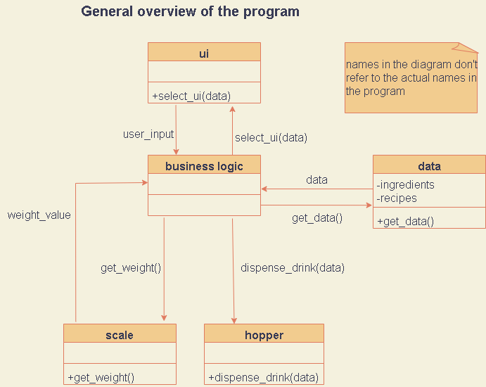
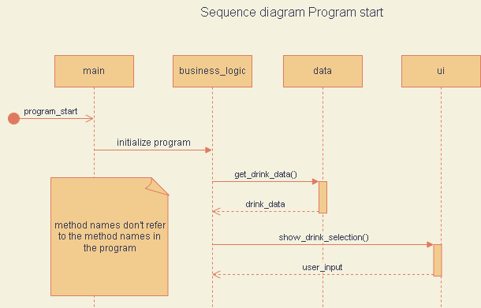
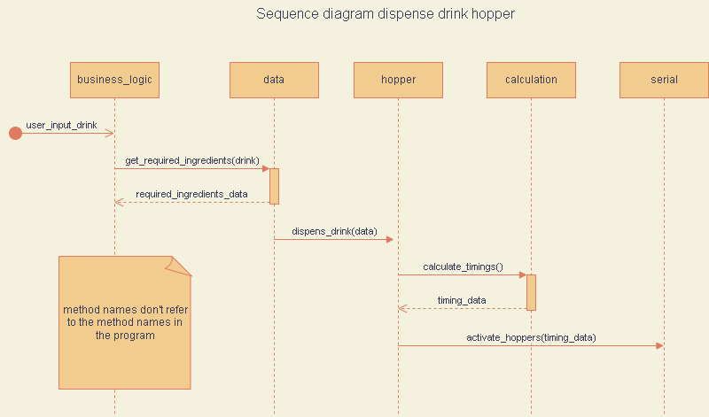
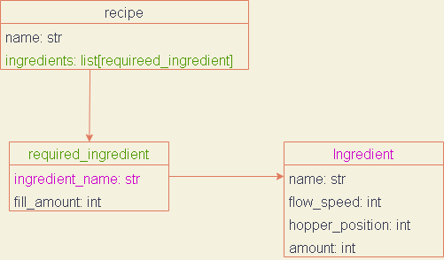

# SIEGMA - DrinkMixingMachine <br/>  Python codebase

## Requirements

- Python version 3.9
- Dependencies from [requirements.txt](requirements.txt)
- Git Submodules (load via `git submodule update --init --recursive` after clone)

## Configuration

The program can be configured by changing the [configuration.json](src/configuration.json) file.
See the [configuration options](#configuration-options) for an explanation.

## Program

Overview of the program:

- 
- 
- 

To run the application execute:

```bash
python src/main.py
```

from the root directory of the repository

## Data model

### General overview of the data model:



> **Ingredient**
>
> - an ingredient is a liquid that can be put on a hopper.
> - [json ingredient file](src/libs/data/data_json/ingredients.json)
>
> ```json
> {
>    "ingredient_name": {
>       "flow_speed": "Integer_value"
>    }
> }
> ```

> **Recipe**
>
> - A recipe is a liquid consisting of one or more ingredients.
> - [json recipe file](src/libs/data/data_json/recipes.json)
>
> ```json
> {
>    "recipe_name": {
>       "ingredient_name": {
>           "fill_amount":  "Integer_value"
>           }
>       }
> }
> ```

## Dispenser Mechanism / Hardware

### General information

- The dispenser mechanism is controlled through rp2040 based microcontroller.
- To activate a dispenser, the Raspberry PI communicates with the RP2040 base microcontroller.
- Each microcontroller controls one to four stepper motor driver that controls one dispenser each.
- The connection between the Raspberry PI and the microcontroller works over serial UART.
- The Raspberry PI is connected to the microcontroller through its USB ports.

### Connection initialization

- The Raspberry PI tries to initialize a connection with a tiny on each USB port that is named in
  the [configuration file](#configuration-options).
- If a connection couldn't be established, the Raspberry PI will throw an Exception.
- After connecting to all microcontrollers, the Raspberry PI will try to identify each connection.
- The Raspberry PI identifies a microcontroller if the identifier (String) send by the microcontroller is the same as
  those in the [configuration file](#configuration-options).
- The Raspberry PI will throw an Exception if an unknown identifier is received.

### Tiny pico communication

- The Raspberry PI calculates the motor timings for each dispenser to be emptied.
- After calculating the timings, the Raspberry PI sends these timings to the corresponding microcontroller.

> **Message Syntax:**  
> `timing_hopper_0;timing_hopper_1;timings_hopper_2;timing_hopper_3;\n`

### Hopper Positions

- Each microcontroller controls up to four dispensers
- The internal positions range from zero - (four * number of microcontrollers)
    - The internal position 0 refers to dispenser 0 on microcontroller 0 in "configure_connection_pi_tiny"
    - The internal position 7 refers to dispenser 3 on microcontroller 1 in "configure_connection_pi_tiny".

## Scale

### General information:

- The scale is connected to a high-performance ADC (hx711)
- The Raspberry PI reads out the scale values by accessing the ADC
- We use an external library to access the hx711
- A scale value in the program is the result of averaging multiple scale values received from the hx711
- The scale needs to be calibrated by using a REFERENCE_UNIT value

### Technical details

- [hx711 git-hub link](https://github.com/tatobari/hx711py)
- [hx711 data sheet link](https://cdn.sparkfun.com/datasheets/Sensors/ForceFlex/hx711_english.pdf)

## Configuration options

> **configuration_only_selection**
> - type: `Boolean`
> - runs a program that only consists of the drink selection if set to true

> **configure_glass_size**
> - type:` Integer`
> - millilitre amount that the glass can hold
> - this value is used during the new recipe creation to check if a new recipe fits in the glass

> **configure_measurements_per_scale_value**
> - type: `Integer`
> - each scale value is calculated as an average
> - this configuration option determines how many measurements are combined to one average

> **configure_max_waiting_time**
> - type: `Integer`
> - this option limits the amount of time the machine waits for a drink to finish dispensing
> - if the current waiting time exceeds the max waiting time, the machine will return to its idle state
> - when the code is run on the machine, the max waiting time should be high enough to prevent early abortions of the
    dispense process

> **configure_connection_pi_tiny**
> - type: `list[String]`
> - holds the path to every serial port on the Raspberry PI from which a Serial connection to a microcontroller should
    be established

> **configure_pico_identifier**
> - type: `list[String]`
> - each microcontroller returns an identifier which is used to differentiate the different microcontroller
> - this option holds all identifiers that the Raspberry PI expects
> - the Raspberry PI throws an Exception if it receives an unknown identifier

> **configure_max_serial_identifier_attempt**
> - type: `Integer`
> - limits the amount of times the Raspberry PI will try to connect and identify a microcontroller
> - if the Raspberry PI hasn't identified the pico after its max attempts, it will throw an Exception

> **configuration_ms_per_ml**
> - type: `Integer`
> - variable that is used to configure the calculation of hopper timings on the Raspberry PI

> **configuration_hopper_sizes**
> - type: `list[Integer]`
> - this option holds the hopper sizes for each hopper measured in millilitre
> - list position n refers to hopper at position n
> - None refers to an empty hopper or no hopper at all.

> **configure_ingredient**
> - type: `file_path`
> - provides the path to the json file with the ingredients
> - [ingredients file](src/libs/data/data_json/ingredients.json)

> **configure_recipe**
> - type: `file_path`
> - provides the path to the json file with the recipes
> - [recipes file](src/libs/data/data_json/recipes.json)

> **configure_ingredients**
> - type: `dict`
> - the dictionary holds the initial configuration of the hoppers with ingredients.
>
> ```json
> {
>     "configure_ingredients": {
>         "ingredient_name": {
>             "hopper_position": "Integer_value",
>             "amount": "Integer_value"
>         }
>     }
> }
> ```
 