# Drink Mixing Machine — UI and Backend

This repository holds the Python codebase for the Drink Mixing Machine backend and user interface.

## Requirements

- Python version 3.9
    - [virtualenv](https://pypi.org/project/virtualenv/) installed

## Setup Guide (Nix based)

1. Assure [Requirements](#requirements) are met
2. Clone the repository: `git clone https://github.com/ES-EDU-SIEGMA/User-Interface.git`
3. Go into repository: `cd User-Interface`
4. Initialize Python virtual environment: `python -m venv .venv`
5. Load the virtual environment: `source .venv/bin/activate`
6. Install required Python dependencies: `pip install -r requirements.txt`
7. Open the project in your IDE of choice
8. Have fun 🎆

> The most convenient way to start the application once the steps 1-6 are done,
> is to execute the [start_machine.sh bash script](./start_machine.sh).

## Configuration

### CLI arguments

```text
usage: main.py [-h] --config CONFIG --ingredients INGREDIENTS --drinks DRINKS

Start the Drink Mixing Machine

optional arguments:
  -h, --help                 show this help message and exit
  --config CONFIG            Absolute path to the config file
  --ingredients INGREDIENTS  Absolute path to the ingredients file
  --drinks DRINKS            Absolute path to the drinks file
```

### Config Files

As seen in the [CLI arguments section](#cli-arguments) the application requires three configuration files to work:

**CONFIG:**

- Provides basic application settings

**INGREDIENTS:**

- Provides the available ingredients alongside their required meta-data

**DRINK:**

- Provides the available drinks alongside their required meta-data
- Represents a combination of different ingredients

> Examples can be found in the [datasources folder](./src/datasources)

## General System Architecture



## FAQ

- [Further Information](https://github.com/ES-EDU-SIEGMA/Documentation/tree/main/documentation)

